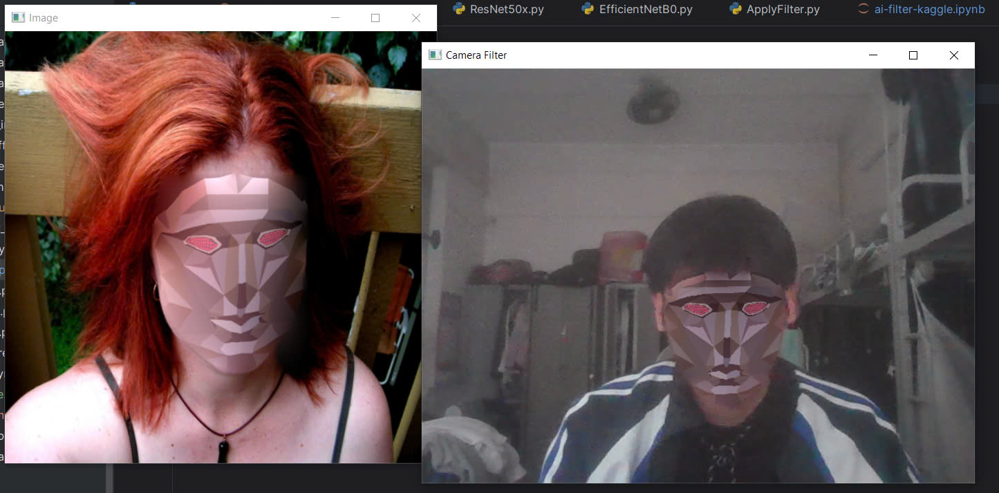

# Face Filter Application

## 📌 Introduction
Face Filter Application is an AI-powered project designed to apply filters to users' faces in images or videos. The system leverages deep learning models such as **ResNet** and **EfficientNet** for precise facial detection and alignment, ensuring realistic and accurate filter application.

### 🔍 How It Works
The application follows a multi-step pipeline to process and modify facial images effectively:

1. **Face Detection**: The system utilizes the `dlib` library to detect faces in images or video frames, ensuring robust and efficient recognition.
2. **Facial Landmark Detection**: A pre-trained **EfficientNet / ResNet** model is used to extract **68 facial landmarks**, providing key reference points for face transformation.
3. **Face Alignment**: The **Delaunay Triangulation algorithm** is applied to these landmarks, ensuring proper face alignment and transformation.
4. **Filter Application**: Once the face is aligned, various filters can be applied dynamically, such as beauty enhancements, cartoon effects, or virtual masks.

### 🏗️ Technologies Used
- **Language**: Python
- **Model**:
  - **Facial Detection**: `dlib`
  - **Facial Landmark Detection**: `EfficientNet` / `ResNet`
- **Libraries**: `OpenCV`, `NumPy`, `dlib`, `scikit-image`
- **Tools**: `Jupyter Notebook`, `Kaggle`
- **Algorithm**: Delaunay Triangulation

These technologies ensure that the application delivers high performance,🚀 Implementation
## 🚀 Implementation

### 1️⃣ Installation
First, clone the repository and install the required dependencies:
```bash
# Clone the repository
git clone https://github.com/BlackRose484/FilterAI.git
cd FilterAI

# Install dependencies
pip install -r requirements.txt
```

### 2️⃣ Training the model
If you want to try some training, you can run the following command:
```bash
python main.py
```

### 3️⃣ Evaluating the Model
To test and evaluate the model performance, run:
```bash
python eval.py
```

### 4️⃣ Directory Structure
```
FilterAI/
│── data/
│   ├── filter          # Contains some filters that you can apply
│   ├── kaggle          # Data for training
│   ├── model           # Contains model pretrained
├── notebooks           # Jupyter notebooks for experimentation, which you can uppload to Kaggle and run
│── src/
│   ├── Data/           # Function for loading data and augmenting
│   ├── Model/          # Model architecture
│   ├── main.py         # Loading data and training the model
│   ├── train.py        # Function for training the model
│   ├── filter.py       # Filter function, which you can apply to the image/video
│   ├── eval.py         # Evaluation script for testing the model
│── README.md          # Documentation
│── requirements.txt   # Required libraries
```

## 🎭 Demo

Here is a demonstration of how the face filter works:

### 🎥 Video Demo


This demo illustrates how the application detects faces, applies filters, and generates results in real time.


